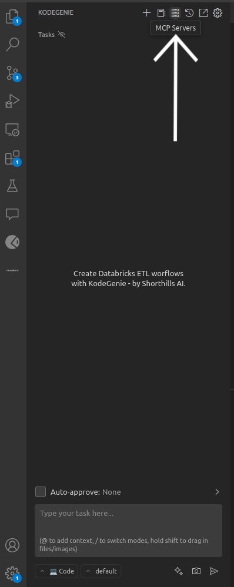
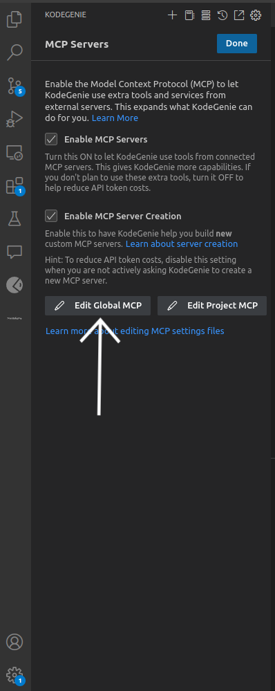
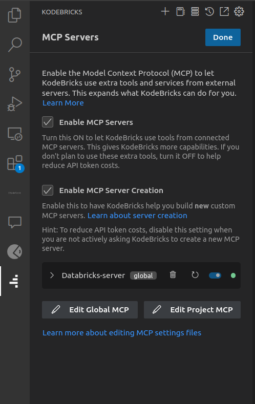
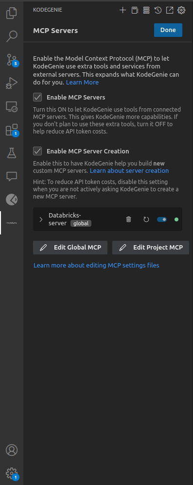

# KodeGenie

## Setup Guide

- Copy [script file](script_file/install_kodegenie.sh) in a local folder.
- Open the terminal and move to that folder where `.sh` file is copied.
- run the command `chmod +x install_kodegenie.sh`.
- Then run the script file by running command `./install_kodegenie.sh`

Now Extension will be downloaded and a `main.py` and `mcp_config.json` file will be created.

## KodeGenie setup
- Open the extension and add suitable LLM API key

## Setup MCP on KodeGenie

- Click on **MCP server** inside extension  

- Click on **Edit Global MCP**  

- A `mcp_settings.json` file will open, in that paste content of `mcp_config.json` created.  

- Inside `mcp_settings.json`:
  - In `env`, write your Databricks credentials

- Save this JSON file

- MCP is connected  

