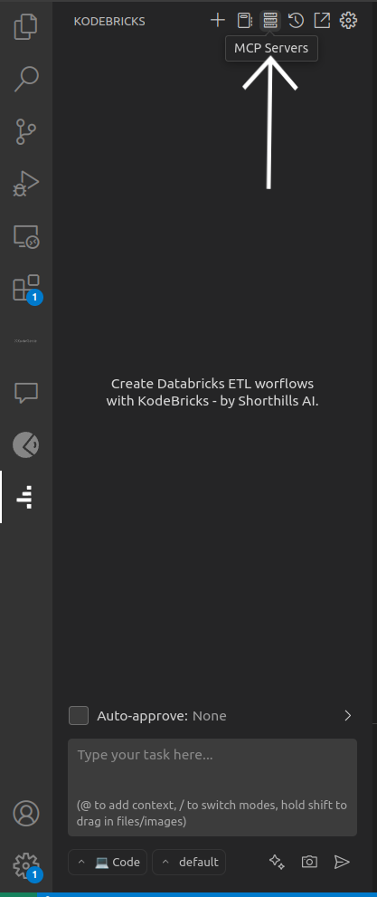

# KodeGenie

## MCP Setup

- Install UV  
`pip install uv`

- Copy `main.py` to local folder from repository

## KodeGenie setup

- Copy `Extension-KodeGenie/KodeGenie-3.18.4.vsix` in local  
- Open folder in VS Code  
- Right click on `KodeGenie-3.18.4.vsix` and click **Install Extension**  

- Now open extension and add suitable LLM API key

## Setup MCP on KodeGenie

- Click on **MCP server** inside extension  

- Click on **Edit Global MCP**  

- A `mcp_settings.json` file will open, in that paste content of `config.json` (in repo)  

- Inside `mcp_settings.json`:
  - In `command` column, write path of UV (you can get this by running `where uv` or `whereis uv` in terminal)
  - In `args` column, write the absolute path of `main.py` file which was copied from repo
  - In `env`, write your Databricks credentials

- Save this JSON file

- MCP is connected  

